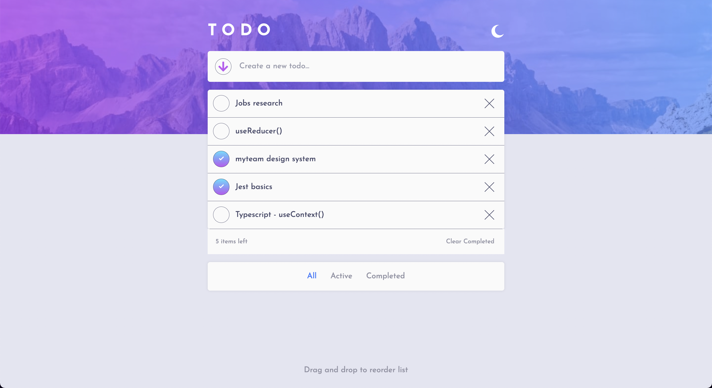

# Frontend Mentor - Todo App solution

This is a solution to the [Todo App challenge on Frontend Mentor](https://www.frontendmentor.io/challenges/todo-app-Su1_KokOW).

## Table of contents

-  [Overview](#overview)
   -  [The challenge](#the-challenge)
   -  [Screenshot](#screenshot)
   -  [Links](#links)
-  [My process](#my-process)
   -  [Built with](#built-with)
   -  [What I learned](#what-i-learned)
   -  [Continued development](#continued-development)
   -  [Useful resources](#useful-resources)
-  [Author](#author)

## Overview

### The challenge

Your users should be able to:

-  View the optimal layout for the app depending on their device's screen size
-  See hover states for all interactive elements on the page
-  Add new todos to the list
-  Mark todos as complete
-  Delete todos from the list
-  Filter by all/active/complete todos
-  Clear all completed todos
-  Toggle between light and dark mode
-  Drag and drop to reorder items on the list

### Screenshot



### Links

-  Live Site URL:

## My process

### Built with

-  Semantic HTML5 markup
-  Mobile-first workflow
-  Flexbox
-  [React](https://reactjs.org/) - JS library
-  [Styled Components](https://styled-components.com/) - For styles
-  TypeScript

### What I learned

```jsx
const lightTheme = {
   fontFamily: 'Josefin Sans',
   colorBg: 'hsl(236, 33%, 92%)',
   ...
}
```

This was my first project using Styled Components to control all styling within my application. I was able to make use of the built in ThemeProvider which uses React's Context API to model and pass down all my global variables to be used throughtout my app. This made building the light and dark theme feature incredibly convenient, allowing me to focus on other logic involved in the process such as saving the user's theme preference in local storage by retrieving the previous state of the checkbox.

```jsx
const List = styled.ul<ListProps>`
   max-height: 385px;
   overflow-y: scroll
   ....
```

CSS wise, I encountered an issue with the lack of responsiveness by the body's height when the number of todos increased to a more realistic amount (five plus). The height wasn't responding because I was positioning the primary wrapper on top of the body, thus placing it on a higher z-index which wasn't going to affect the lower level of content beneath. To fix this, I decided to negatively position the `<header>`, `<main>` and `<footer>` sections whilst keeping the todo list wrapper in the normal DOM flow to allow the desired responsive behaviour to occur.

```jsx
export interface AppState {
   todos: {
      id: string
      key: string
      value: string
      isCompleted: boolean
      invisible: boolean
   }[]
}
```

This project was also my first formal introduction to using Typescript, a superset of JavaScript which adds strict types to the language and therefore catches a number of compile time, type-based bugs without us needing to run our code first. I learnt about the differences between types and interfaces, and the different methods we can use to pass those types around to prevent repeating ourselves.

Furthermore, as displayed above I decided to type and model each todo from an object of data about it, which contrasted to my original method of declaring this data directly via props when each todo was originally created. As such, I began storing the Todo component itself within the App's state, and was unable to modify the props for each todo since they were readonly.

```jsx
const handleRemoveTodo: AppState['handleRemoveTodo'] = (id) => {
   const newTodos = todos.filter((todo: any) => todo.id !== id)
   setTodos(newTodos)
}
```

The above function showcases a piece of classic React logic and a concept which I first learnt about when practicing basic DOM manipulation in vanilla JavaScript. Back then I was able to target the DOM element which the user wanted to manipulate and execute a `remove()` method on it, but React forces you to think more dynamically about how to achieve this which I appreciate.

```jsx
const dragOver: DnD['dragOver'] = (e) => {
   const id = e.dataTransfer.getData('todo-id')
   ...
}
```

The final test of this project was to produce a sortable drag & drop list which the user could manually interact with to re-arrange the order of each todo. This was my first introduction to the Drag & Drop API built into JavaScript, which conveniently provides a handful of properties and methods for us to use in order to successfully create this logic.

By far the most difficult part of this feature was implementing the logic to calculate the position of the todo being dragged, which would then be used in accordance with its draggable parent container to append the todo at the desired position. I look forward to learning more about advanced data structures and different algorithmic logic I could use to store an updated version of this list in local storage, which would then be updated each time the user rearranges the list's order.

### Continued development

In this project, I achieved the filtering logic stylistically through a dynamic 'invisible' boolean property modelled in each TODO, which when truthy would render those todos invisible on the page. However, I realise for future projects another method might be to create different versions of the parent state, which would then cause the app to respond and display different data based on which state held a valid form of data.

Finally, I decided to experiment with the different possibilities available to us through Styled Components, but in the process ended up mixing multiple components with their render function in the same file. Although this was interesting to see the functional possibility, it made searching for the desired component very cumbersome as they were often stored within other files that were not appropriately named. In the future, I plan to organise all my components by separating styled and non-styled components, whilst using sub-folders to make searching for the desired file much more convenient.

### Useful resources

-  [Web Dev Simplified - Learn React in 30 Minutes](https://www.youtube.com/watch?v=hQAHSlTtcmY&t=1336s&ab_channel=WebDevSimplified) - Kyle's tutorial helped me tremendously with the fundamental logic of a TODO list app, since React requires a different methodology to achieving the same behaviour in vanilla JavaScript.

-  [Traversy Media - Styled Components Crash Course](https://www.youtube.com/watch?v=02zO0hZmwnw&t=945s&ab_channel=TraversyMedia) - This crash course was my first introduction to using Styled Components, focusing on the basic syntax and major features to begin using the library in current projects.

-  [Web Dev Simplified - How to Build Sortable Drag & Drop](https://www.youtube.com/watch?v=jfYWwQrtzzY&t=582s&ab_channel=WebDevSimplified) - This was another great tutorial by Kyle which helped me build the fundamental logic for the drag & drop behviour of the app. This was however originally built in vanilla JavaScript, so I was forced to modify the solution for React which greatly helped in ensuring I understood what was occuring behind the scenes.

## Author

-  Website - [Joshua Jameson-Wallis](https://joshuajamesonwallis.com)
-  Linkedin - [Joshua Jameson-Wallis](https://www.linkedin.com/in/joshua-jameson-wallis/)
