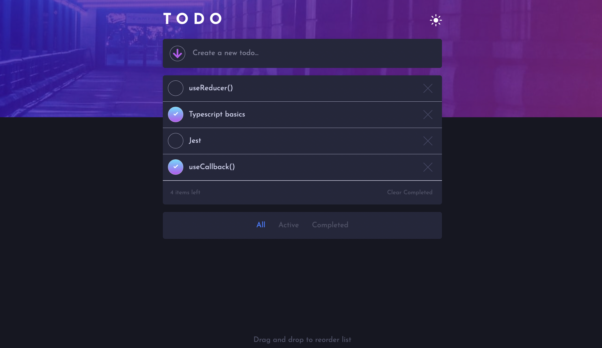

# Frontend Mentor - Todo App solution

This is a solution to the [Todo App challenge on Frontend Mentor](https://www.frontendmentor.io/challenges/todo-app-Su1_KokOW).

## Table of contents

-  [Overview](#overview)
   -  [The challenge](#the-challenge)
   -  [Screenshot](#screenshot)
   -  [Links](#links)
-  [My process](#my-process)
   -  [Built with](#built-with)
   -  [What I learned](#what-i-learned)
   -  [Continued development](#continued-development)
   -  [Useful resources](#useful-resources)
-  [Author](#author)

## Overview

### The challenge

Your users should be able to:

-  View the optimal layout for the app depending on their device's screen size
-  See hover states for all interactive elements on the page
-  Add new todos to the list
-  Mark todos as complete
-  Delete todos from the list
-  Filter by all/active/complete todos
-  Clear all completed todos
-  Toggle between light and dark mode
-  Drag and drop to reorder items on the list

### Screenshot



### Links

-  Live Site URL:

## My process

### Built with

-  React - JS Library
-  Typescript
-  Mobile-first workflow
-  Styled Components
-  Flexbox
-  Semantic HTML5 markup

### What I learned

```jsx
const lightTheme = {
   fontFamily: 'Josefin Sans',
   colorBg: 'hsl(236, 33%, 92%)',
   colorFg: 'hsl(0, 0%, 98%)',
   ...
}
```

This was my first project using the library Styled Components to control all styling within my application. As shown above, I was able to make use of the built in ThemeProvider (using React's Context API) to model and pass down all my global variables to be used by all my styled components. This made building the light & dark theme feature incredibly simple and convenient, allowing me to focus on pontential other logic involved in the process, such as saving the users theme preference in local storage (via the state of the checkbox).

```jsx
const List = styled.ul<ListProps>`
   max-height: 385px;
   overflow-y: scroll
   ....
```

To my suprise I did encounter a number of CSS based issues throughout the development of this project, notably the lack of responsiveness by the body/viewport height when the number of todos increased to a more realistic amount. This was not responding because I was positioning the whole todo list wrapper on top of the body, thus placing it on a higher z-index which wasn't going to affect the lower level of content beneath it. In order to fix this bug, I decided to negatively position the `<header>`, `<main>` and `<footer>` sections, whilst keeping the todo list wrapper in the normal DOM flow to allow the desired responsive behaviour to occur.

```jsx
export interface AppState {
   todos: {
      id: string
      key: string
      value: string
      isCompleted: boolean
      invisible: boolean
   }[]
}
```

This project was also my first formal introduction to using Typescript, a superset of JavaScript which adds strict types to the language and therefore catches a number of compile time, type-based bugs without us even needing to execute our code first. I learnt about the differences between types and interfaces, and the different methods we can use to pass those types around to prevent us repeating ourself accross components. This became particulary important in React, since I constantly found myself using data that was already typed in the App componet within child components.

Furthermore, as displayed above I decided to type and model each todo through an object of data about it, which contrasted to my original method of declaring this data via direct props when each todo was rendered (storing the Todo component itself within the App's state). I quickly realised these props were not able to be modified when modelling each todo in this way, which was an incredibly important feature to be able to achieve any of the base logic required.

```jsx
const handleRemoveTodo: AppState['handleRemoveTodo'] = (id) => {
   const newTodos = todos.filter((todo: any) => todo.id !== id)
   setTodos(newTodos)
}
```

The above function showcases classic React logic and a different process required in the framework to achieve functionality which I first learnt about when practicing basic DOM manipulation in vanilla JavaScript. Back then I was able to target the DOM element which the user wanted to manipulate, and then simply execute a `remove()` method on it to completely delete it from the DOM. However, React provides many features that allows us to re-create the same logic in a much more efficient and dynamic manner, yet we are also forced to use these different solutions so as not to incorrectly modify the state in our app.

```jsx
const dragOver: DnD['dragOver'] = (e) => {
   const id = e.dataTransfer.getData('todo-id')
   ...
}
```

Drag + drop - appends as last child when drag anywhere (even over same el)
Calculations needed from middle of parent | dataTransfer - way of getting info cross component (use refs later?)| saw YT vid claiming advance algorithm needed - potentially lack of knowledge at this point

### Continued development

As I continued to build out each feature, I found my App component was quickly becoming bloated with important fundamental logic which I wasn't able to house anywhere else. I therefore look forward to learning about more advanced React concepts such as custom hooks, which I believe will come into play here so I can extract this logic into its own re-usable component (thus refactoring my parent App).

In this project I achieved the filtering logic stylistically through a dynamic 'invisible' boolean property for each TODO, which when toggled to true would render those todos invisible on the page. However, I realise for future project another method might be to create different versions of the parent state, which would then cause the app to respond and display different data based on certain states storing valid data.

Finally, I decided to experiment with the different possibilities available through Styled Components, but in the process ended up mixing multiple styled components with their render function in the same file. Although interesting to see how this was possible, it made searching for the desired component very cumbersome as they were often stored within other files that were not appropriately named. In the future I plan to organise all my components much better by separating styled components with non-styled components, using sub-folders to make searching for the desired file much more convenient.

### Useful resources

-  [Web Dev Simplified - Learn React in 30 Minutes](https://www.youtube.com/watch?v=hQAHSlTtcmY&t=1336s&ab_channel=WebDevSimplified) - Kyle's tutorial helped me tremendously with the fundamental logic of a TODO list application modelled in React, since the framework requires a different methodology to achieving the same behaviour in vanilla JavaScript.

-  [Traversy Media - Styled Components Crash Course](https://www.youtube.com/watch?v=02zO0hZmwnw&t=945s&ab_channel=TraversyMedia) - This crash course was my first introduction to using Styled Components, focusing on the syntax and major features to begin using the library in projects.

-  [Web Dev Simplified - How to Build Sortable Drag & Drop](https://www.youtube.com/watch?v=jfYWwQrtzzY&t=582s&ab_channel=WebDevSimplified) - This was another great tutorial by Kyle which helped me build the fundamental logic for the drag & drop behviour of the app. This was however originally built in vanilla JavaScript, so I was forced to modify the solution for the React framework, which greatly helped in ensuring I understood what was occuring behind the scenes.

## Author

-  Website - [Joshua Jameson-Wallis](https://joshuajamesonwallis.com)
-  Linkedin - [Joshua Jameson-Wallis]()
